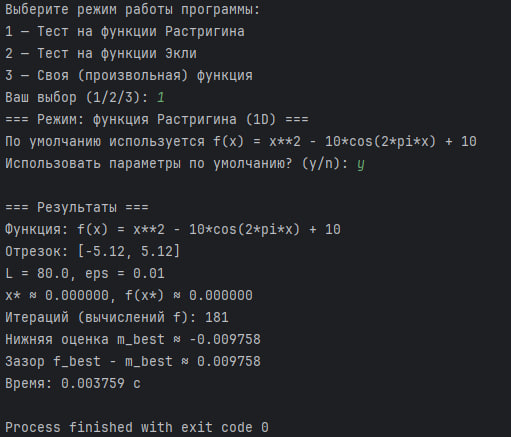
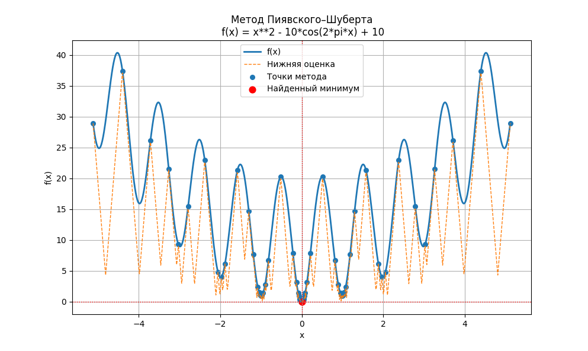
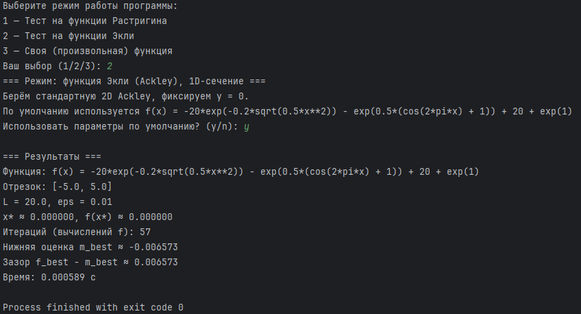
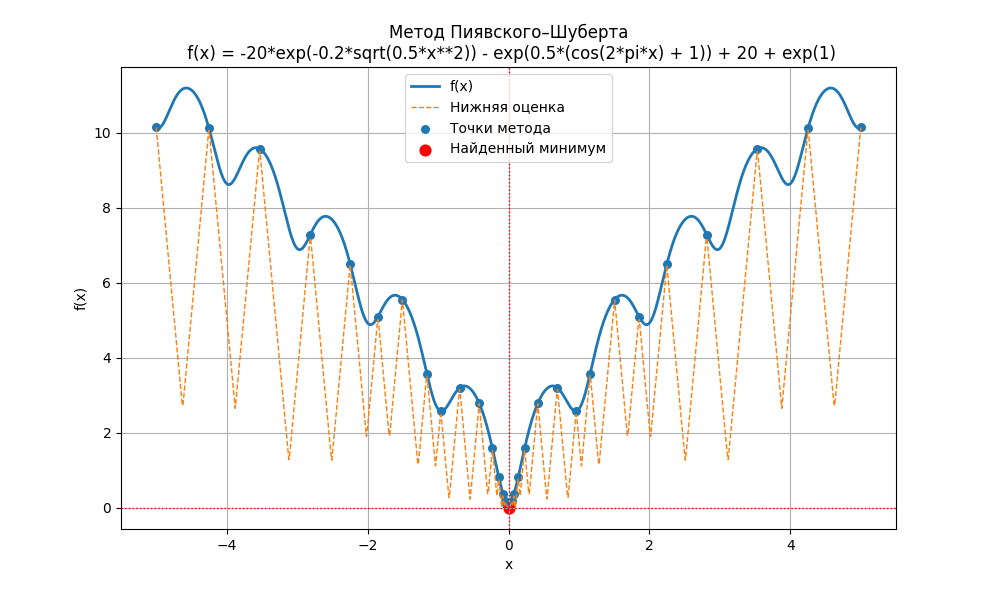
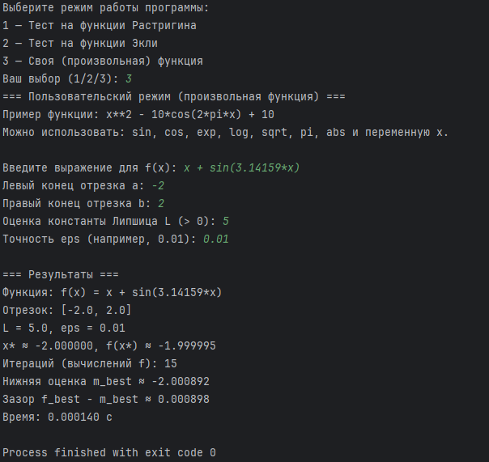
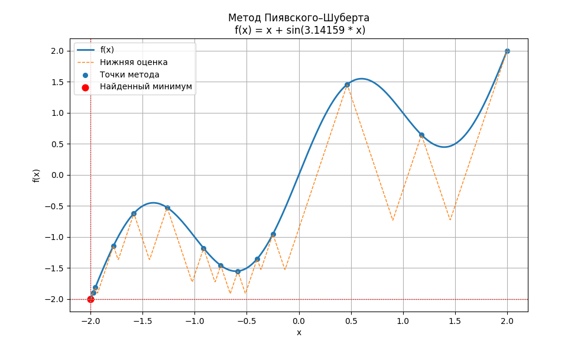

# Лабораторная работа: Метод ломаных
*Гайдук Алина Сергеевна*

*Поток МЕТ ОПТ 1.1*

## Ревью
[Ссылка на ревью](https://drive.google.com/drive/folders/1gKRmd3Pj0I9a3WixrNuRGp75jFCgbRuq?dmr=1&ec=wgc-drive-hero-goto)

---
## 1. Цель работы

Реализовать программу на языке Python, которая:

- выполняет **поиск глобального минимума** липшицевой одномерной функции на заданном отрезке;
- использует **метод Пиявского–Шуберта**;
- принимает **строку функции**, границы отрезка, оценку константы Липшица и точность;
- выполняет **визуализацию**:
  - графика функции;
  - точек, в которых проводился поиск;
  - ломаной нижней оценки (по методу Пиявского–Шуберта);
  - найденного приближённого минимума.

Также демонстрируется работа программы на **тестовых функциях**:  
— одномерная функция **Растригина**;  
— одномерное сечение функции **Экли**.

---


## 2. Структура программы

В файле (например, `solver.py`) реализованы следующие основные компоненты:

### 2.1. `make_function(expr)`

Создаёт функцию `f(x)` из строкового выражения `expr`.

Разрешены:

- переменная: `x`;
- функции: `sin`, `cos`, `tan`, `exp`, `log`, `sqrt`, `abs`;
- константа: `pi`.

Пример:

```
f = make_function("x**2 - 10*cos(2*pi*x) + 10")
print(f(0))  # 0
```

### 2.2. `piyavskii_shubert(f, a, b, L, eps=0.01, max_iter=1000)`

Реализация метода Пиявского–Шуберта.

Параметры:

- `f` — функция одной переменной (callable);
- `a`, `b` — границы отрезка;
- `L` — оценка константы Липшица;
- `eps` — точность (по зазору `f_best - m_best`);
- `max_iter` — максимум вычислений `f(x)`.

Возвращает:

- `X` — список точек, в которых считалась функция (отсортирован по `x`);
- `F` — значения `f(x)` в этих точках;
- `best_idx` — индекс найденного минимума;
- `iterations` — число вычислений `f(x)`;
- `elapsed` — время работы метода (секунды);
- `m_best` — лучшая нижняя оценка минимума;
- `f_best` — лучшее найденное значение функции.

### 2.3. `plot_results(...)`

Строит:

- график исходной функции;
- ломаную нижней оценки (по методу Пиявского);
- точки выборок;
- отмечает найденный минимум.

Используется библиотека `matplotlib`.

### 2.4. `run_experiment(expr, a, b, L, eps)`

Обобщённая функция:

- принимает строку с выражением функции и параметры метода;
- строит `f(x)`;
- запускает метод Пиявского–Шуберта;
- выводит численные результаты;
- строит график.

---

## 3. Режимы работы программы

В программе реализовано **три режима** (через консольное меню):

```
Выберите режим работы программы:
1 — Тест на функции Растригина
2 — Тест на функции Экли (Ackley)
3 — Своя (произвольная) функция
```

### 3.1. Режим 1 - функция Растригина

Одномерная функция Растригина имеет множество локальных минимумов и один глобальный минимум в точке \(x = 0\).

### 3.2. Режим 2 - функция Экли (Ackley), одномерное сечение

Используется одномерное сечение стандартной 2D-функции Экли при `y = 0`.

### 3.3. Режим 3 - произвольная функция пользователя

Пользователь вводит:

- строку функции `f(x)`;
- левый и правый концы отрезка `a`, `b`;
- оценку константы Липшица `L`;
- точность `eps`.

---

## 4. Запуск программы

### 4.1. Требования

- Python 3.8+
- Установленные библиотеки:
  - `numpy`
  - `matplotlib`

Установка зависимостей:

```bash
pip install numpy matplotlib
```

### 4.2. Запуск

```
python main.py
```

---

## 5. Выводимые результаты

Программа выводит:

- строку функции `f(x)`;
- отрезок `[a, b]`;
- параметры `L`, `eps`;
- найденное приближённое значение аргумента `x*`;
- значение функции `f(x*)`;
- число итераций;
- нижнюю оценку `m_best`;
- зазор `f_best - m_best`;
- время работы (сек).

Также строится график:

- синяя линия — функция `f(x)`;
- пунктир — нижняя оценка;
- точки — испытания метода;
- красная точка — найденный минимум.

---

## 6. Демонстрация 

### 6.1 Функция Растригина

Вывод в консоли: 



График: 



### 6.2 Функция Экли

Вывод в консоли: 



График: 



### 6.1 Функция пользователя

Вывод в консоли: 



График: 




## Вывод 

В ходе лабораторной работы реализована программа на языке Python для поиска глобального минимума одномерной липшицевой функции методом Пиявского–Шуберта.
Программа позволяет вводить произвольные функции, задавать параметры поиска и визуализировать результаты.
На тестовых функциях Растригина, Экли и пользовательской функции подтверждена корректность и эффективность метода.
